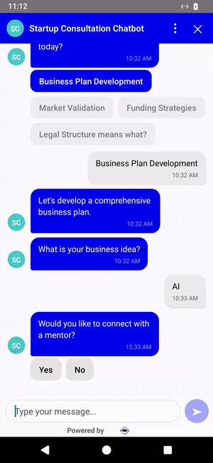
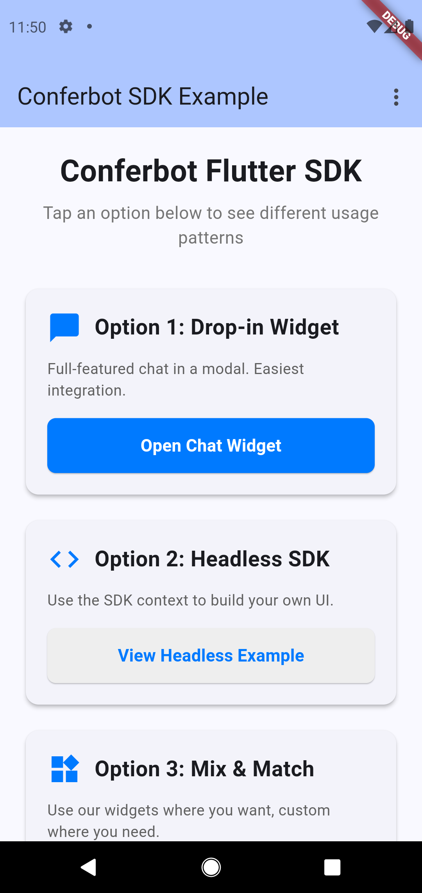
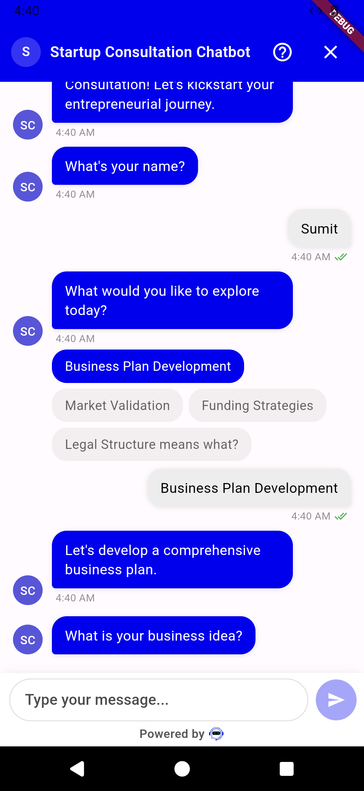

# Conferbot Flutter SDK

[](https://pub.dev/packages/conferbot_flutter)
[](https://flutter.dev)
[](https://dart.dev)
[](LICENSE)

Native Flutter SDK for embedding Conferbot AI chatbots into iOS and Android applications.

## See it in action

The complete flow recorded live on an Android emulator against production: open the widget, bot loads with the flow builder's theme, name question, choice selection, and the next flow node - end to end.

<p align="center">
  
</p>

<p align="center"><a href="docs/demo.mp4">HD video (MP4)</a></p>

<p align="center">
  
  
  
</p>

---

## Table of Contents

- [Installation](#installation)
- [Quick Start](#quick-start)
- [Floating Bubble (FAB)](#floating-bubble-fab)
- [Passing User Identity](#passing-user-identity)
- [Theming and Flow-Builder Customizations](#theming-and-flow-builder-customizations)
- [Advanced](#advanced)
- [API Reference](#api-reference)
- [Troubleshooting](#troubleshooting)
- [Example App](#example-app)

## Installation

Add the package to your `pubspec.yaml` (package name `conferbot_flutter`, current version `1.0.0`):

```yaml
dependencies:
  conferbot_flutter: ^1.0.0
```

Then fetch dependencies:

```bash
flutter pub get
```

Requirements: Flutter `>=3.10.0`, Dart SDK `>=3.0.0 <4.0.0`.

If you use session persistence (on by default), initialize Hive storage once before `runApp`:

```dart
void main() async {
  WidgetsFlutterBinding.ensureInitialized();
  await StorageService.init(); // required for session persistence
  runApp(const MyApp());
}
```

### Credentials

You need a **bot ID** (and optionally an API key) from the [Conferbot dashboard](https://app.conferbot.com):

1. Log in and create or select a bot.
2. Publish the bot (unpublished bots do not serve a flow).
3. Copy the bot ID from the bot's settings or from the embed snippet.

No account yet? The public demo bot `691c970890527a0468f9b2c9` works without one - it is the same bot the example app ships with.

## Quick Start

The smallest working integration: create one `ConferBotProvider` at the top of your tree, then push the drop-in `ChatWidget` whenever you want to show the chat.

```dart
import 'package:flutter/material.dart';
import 'package:provider/provider.dart';
import 'package:conferbot_flutter/conferbot_flutter.dart';

void main() async {
  WidgetsFlutterBinding.ensureInitialized();
  await StorageService.init();
  runApp(
    ChangeNotifierProvider(
      create: (_) => ConferBotProvider(
        apiKey: 'YOUR_API_KEY',
        botId: '691c970890527a0468f9b2c9', // demo bot, replace with yours
      ),
      child: const MyApp(),
    ),
  );
}

class MyApp extends StatelessWidget {
  const MyApp({super.key});

  @override
  Widget build(BuildContext context) {
    return const MaterialApp(home: HomeScreen());
  }
}

class HomeScreen extends StatelessWidget {
  const HomeScreen({super.key});

  @override
  Widget build(BuildContext context) {
    return Scaffold(
      appBar: AppBar(title: const Text('My App')),
      floatingActionButton: FloatingActionButton(
        child: const Icon(Icons.chat),
        onPressed: () {
          Navigator.push(
            context,
            MaterialPageRoute(
              builder: (_) => ChangeNotifierProvider.value(
                value: context.read<ConferBotProvider>(),
                child: const ChatWidget(
                  title: 'Support Chat',
                  placeholder: 'Type your message...',
                ),
              ),
            ),
          );
        },
      ),
    );
  }
}
```

`ChatWidget` is the complete chat UI: header with bot name and avatar, message list with pagination, all 51 flow node types, offline banner, live agent handover, knowledge base, and the input bar. It calls `openChat()` on the provider automatically when it appears.

## Floating Bubble (FAB)

For web-widget parity - a chat bubble floating at the bottom-right of your app that opens the chat in a bottom sheet - wrap your app content in `ConferBotFAB`. The real constructor:

```dart
const ConferBotFAB({
  super.key,
  required this.child,          // Widget: your app content
  this.config = const ConferBotFABConfig(),
  this.theme,                   // ConferBotTheme? forwarded to ChatWidget
});
```

`ConferBotFAB` must sit below a `ConferBotProvider` in the tree:

```dart
class MyApp extends StatelessWidget {
  const MyApp({super.key});

  @override
  Widget build(BuildContext context) {
    return MaterialApp(
      home: ChangeNotifierProvider(
        create: (_) => ConferBotProvider(
          apiKey: 'YOUR_API_KEY',
          botId: 'YOUR_BOT_ID',
        ),
        child: ConferBotFAB(
          child: Scaffold(
            appBar: AppBar(title: const Text('My App')),
            body: const Center(child: Text('Your app content')),
          ),
        ),
      ),
    );
  }
}
```

Or use the one-liner convenience wrapper `ConferBotFABScope`, which creates the provider for you:

```dart
ConferBotFABScope(
  apiKey: 'YOUR_API_KEY',
  botId: 'YOUR_BOT_ID',
  child: MaterialApp(home: MyHomePage()),
)
```

Full `ConferBotFABScope` parameters: `apiKey`, `botId`, `child` (required), plus optional `fabConfig` (`ConferBotFABConfig`), `providerConfig` (`ConferBotConfig`), `customization` (`ConferBotCustomization?`), `user` (`ConferBotUser?`), `baseUrl`, `socketUrl`.

### Local fallback config

`ConferBotFABConfig` holds compile-time fallbacks. Server values from the dashboard always take precedence when present:

```dart
const ConferBotFABConfig({
  this.size = 50.0,                     // bubble diameter in dp
  this.position = FabPosition.right,    // FabPosition.left or .right
  this.offsetX = 10.0,                  // horizontal offset from screen edge
  this.offsetBottom = 10.0,             // offset from screen bottom
});
```

### What the bubble does

- Tapping opens the chat in a `showModalBottomSheet` (draggable, 92% of screen height); the icon morphs to a close (X) while open.
- Shows a red unread-count badge when messages arrive while the chat is closed.
- Shows an animated CTA tooltip next to the bubble (after 2 seconds) when a `chatIconCtaText` is configured in the dashboard. Users can dismiss it.
- Renders the same bubble icon set as the web widget (`WidgetBubbleIcon1` through `WidgetBubbleIcon15`), painted natively from the dashboard's `widgetIconSVG` setting.

### Server-driven bubble appearance

These flow-builder settings are read live from the server and override `ConferBotFABConfig`:

| Dashboard setting | Effect |
|---|---|
| `widgetIconBgColor` (fallback `headerBgColor`) | Bubble color (default `#1B55F3`) |
| `widgetSize` | Bubble diameter |
| `widgetPosition` | `left` or right side |
| `widgetOffsetLeft` / `widgetOffsetRight` / `widgetOffsetBottom` | Edge offsets |
| `widgetBorderRadius` | Bubble corner radius (default: circle) |
| `widgetIconSVG` | Which bubble icon to draw |
| `chatIconCtaText` | CTA tooltip text |

## Passing User Identity

Identify the visitor by passing a `ConferBotUser` to the provider (or to `ConferBotFABScope`):

```dart
ConferBotProvider(
  apiKey: 'YOUR_API_KEY',
  botId: 'YOUR_BOT_ID',
  user: const ConferBotUser(
    id: 'user-42',                 // required
    name: 'Jane Doe',
    email: 'jane@example.com',
    phone: '+15551234567',
    metadata: {'plan': 'pro'},
  ),
)
```

The model (from `lib/src/models/user.dart`):

```dart
const ConferBotUser({
  required this.id,
  this.name,
  this.email,
  this.phone,
  this.metadata,
});
```

How it is used today: when a chat session starts, the SDK calls `POST /session/init` with `userId: user.id` (falling back to the auto-generated visitor ID), so conversations are attributed to your user across sessions. The `name`, `email`, `phone`, and `metadata` fields are part of the public model but are not yet transmitted to the server by this SDK version - collect those via flow nodes (ask-question, pre-chat form) if you need them on the dashboard side.

If no user is passed, the SDK generates a persistent anonymous visitor ID (stored via Hive) and reuses it across app restarts.

## Theming and Flow-Builder Customizations

### Server customizations apply automatically

When the widget connects, the server sends the bot's flow-builder customizations (the same ones the web widget uses): header colors, bubble colors, chat background, bot name, bot avatar, font size, and bubble border radius. The SDK builds a theme from them via `ConferBotProvider.serverTheme` and applies it with no code on your side.

Keys consumed from the dashboard: `headerBgColor`, `headerTextColor`, `botMsgColor`, `botTextColor`, `userMsgColor`, `userTextColor`, `optionBubbleMsgColor`, `optionBubbleTextColor`, `chatBgColor`, `fontSize`, `bubbleBorderRadius`, plus `botName` / `logoText` (header title) and `avatar` / `logo` (header and message avatar).

### Precedence: server settings override local theme

This is exact, from `ChatWidget.build`:

```dart
final effectiveTheme = provider.serverCustomizations != null
    ? provider.serverTheme
    : (widget.theme ?? defaultTheme);
```

So:

1. If the server sent customizations, **`serverTheme` is used and your local `theme:` is ignored** for the chat UI. `serverTheme` itself is `defaultTheme` with the dashboard values merged over it, and any color the dashboard omits falls back to the web widget defaults (`#1B55F3` bubbles, white text).
2. If the server sent nothing (for example, offline before first fetch), your local `theme:` applies.
3. Otherwise `defaultTheme` (light) applies.

The FAB follows the same rule: server bubble settings win over `ConferBotFABConfig`.

If you want your own branding to win, do not set colors in the bot's flow-builder appearance settings; leave them at defaults and pass a local theme.

### Local themes

```dart
// Built-ins
ChatWidget(theme: defaultTheme); // light
ChatWidget(theme: darkTheme);    // dark

// Custom: start from a built-in and override
final brandTheme = defaultTheme.copyWith(
  colors: defaultTheme.colors.copyWith(
    primary: const Color(0xFF6366F1),
    headerBg: const Color(0xFF6366F1),
    userBubble: const Color(0xFF6366F1),
    botBubble: const Color(0xFFF3F4F6),
  ),
  borderRadius: const ConferBotBorderRadius(bubble: 20.0),
);

ChatWidget(theme: brandTheme);
```

`ConferBotTheme` is composed of `ConferBotColors`, `ConferBotTypography`, `ConferBotSpacing`, `ConferBotBorderRadius`, `ConferBotShadows`, `ConferBotAnimations`, and `ConferBotLayout`, all with `copyWith`-friendly construction (colors have a full `copyWith`; the others are const-constructible with named defaults).

Note: the provider also accepts a `ConferBotCustomization` object (`primaryColor`, `fontFamily`, `bubbleRadius`, `headerTitle`, `enableAvatar`, `avatarUrl`, `botBubbleColor`, `userBubbleColor`). It is currently stored but not applied to rendering in this version - use `ConferBotTheme` for local styling instead.

## Advanced

### Headless usage (custom UI)

`ConferBotProvider` is a `ChangeNotifier` and the whole SDK works without any of the bundled widgets:

```dart
final provider = context.watch<ConferBotProvider>();

// State
final messages = provider.record;            // List<RecordItem>
final connected = provider.isConnected;
final agent = provider.currentAgent;         // Agent? during live handover
final uiState = provider.currentUIState;     // current interactive node state
final done = provider.isFlowComplete;

// Actions
await provider.openChat();                   // start or resume the session
await provider.sendMessage('Hello!');        // free-text answer / live chat message
provider.submitResponse(choiceValue);        // answer the current interactive node
provider.initiateHandover(message: 'I need a human');
provider.sendTypingStatus(true);
provider.resetConversation();
```

For interactive nodes you can either build your own UI from `currentUIState` (typed states like `SingleChoiceUIState`, `RatingUIState`, `CalendarUIState`, ...) or reuse the SDK's `NodeRenderer`. Individual building blocks are also exported: `ChatHeader`, `MessageList`, `SimpleMessageList`, `MessageBubble`, `ChatInput`, `ChatBottomBar`, `TypingIndicator`, `ConnectionStatus`, `OfflineIndicator`, `Avatar`, `EmptyState`.

### Socket events

Subscribe to the raw real-time events:

```dart
provider.on(SocketEvents.botResponse, (data) { /* bot node arrived */ });
provider.on(SocketEvents.agentAccepted, (data) { /* human joined */ });
provider.on(SocketEvents.agentMessage, (data) { /* agent message */ });
provider.on(SocketEvents.agentTypingStatus, (data) { /* typing */ });
provider.on(SocketEvents.chatEnded, (data) { /* chat closed */ });

provider.off(SocketEvents.botResponse);      // unsubscribe
provider.emit('custom-event', {'k': 'v'});   // raw emit
```

### Offline behavior

Built in and on by default (`ConferBotConfig.enableOfflineMode`):

- `ConnectivityService` watches network state (connectivity_plus).
- Outgoing messages sent while offline are queued by `MessageQueueService` and retried automatically when connectivity returns; `ChatWidget` shows an offline banner (`OfflineIndicator`) with pending count and a retry-all action, and the input placeholder switches to "Offline - messages will be queued".
- `ChatWidget(showOfflineIndicator: ..., showDeliveryStatus: ...)` control the UI parts.

### Session persistence

On by default (`enablePersistence: true`). Sessions are stored in Hive and restored on restart within the `sessionTimeout` (default 30 minutes, matching the web widget). Requires `await StorageService.init()` before `runApp`. Related APIs: `provider.sessionRestored`, `provider.persistState()`, `provider.clearCurrentSession()`, `provider.clearAllPersistedData()`, `provider.getStorageStats()`.

### Push token registration

Register a device token (FCM, APNs, or any provider) against the current chat session:

```dart
await provider.registerPushToken(deviceToken);
```

Signature: `Future<void> registerPushToken(String token)` - it posts to `/push/register` with the session ID and platform. It is a no-op until a chat session exists (open the chat first). The SDK does not itself integrate Firebase; you obtain the token in your app.

### Knowledge base

A searchable help center is built in and reachable from the `ChatWidget` header (toggle with `showKnowledgeBase:`). You can also embed it directly:

```dart
ChangeNotifierProvider(
  create: (_) => KnowledgeBaseProvider(
    apiKey: 'YOUR_API_KEY',
    botId: 'YOUR_BOT_ID',
  ),
  child: const KnowledgeBaseScreen(
    title: 'Help Center',
    showCategories: true,
    showSearch: true,
  ),
)
```

`KnowledgeBaseService` exposes the underlying REST calls (`fetchArticles`, `searchArticles`, article detail, ratings). Articles can be inserted into the chat via `ChatWidget.onArticleInsert`.

### Analytics

On by default (`enableAnalytics: true`); events are batched and flushed every `analyticsFlushInterval` (default 30 s). Public hooks on the provider: `trackInteraction(type:, data:)`, `trackGoalCompletion(goalId:, conversionEvent:, conversionValue:)`, `submitChatRating(csatScore:, feedback:, thumbsUp:, npsScore:, source:)`, `trackTypingStart()`, `trackTypingEnd()`, `trackDeletion()`, `flushAnalytics()`, `getAnalyticsData()`.

### Custom endpoints and network tuning

By default the SDK talks to `https://wdt.conferbot.com` (REST base `https://wdt.conferbot.com/api/v1/mobile`). Override globally before creating the provider, or per provider:

```dart
// Global
ConferBotEndpoints.configure(
  apiBaseUrl: 'https://your-host/api/v1/mobile',
  socketUrl: 'https://your-host',
);
ConferBotNetworkConfig.configure(
  apiTimeout: const Duration(seconds: 15),
  reconnectionAttempts: 10,
);

// Per provider
ConferBotProvider(apiKey: '...', botId: '...', baseUrl: '...', socketUrl: '...');
```

### Voice messages and media

Voice recording/playback (`VoiceInputWidget`, `VoiceRecorder`, `VoicePlayer`, `VoiceMessage`) and media viewers (`ImageViewer`, `VideoPlayerWidget`, `AudioPlayerWidget`) are exported and used automatically by the relevant flow nodes. Markdown rendering with syntax-highlighted code blocks is built into bot messages (`MarkdownMessage`).

## API Reference

Signatures below are copied from source. Full generated docs: [docs/API.md](docs/API.md), [docs/COMPONENTS.md](docs/COMPONENTS.md).

### Entry points

| Class / member | Signature | Description |
|---|---|---|
| `ConferBotProvider` | `ConferBotProvider({required String apiKey, required String botId, ConferBotConfig config = const ConferBotConfig(), ConferBotCustomization? customization, ConferBotUser? user, String? baseUrl, String? socketUrl})` | Core state manager; connects socket and REST, runs the node flow engine |
| `ConferBotConfig` | `const ConferBotConfig({bool enableNotifications = true, bool enableOfflineMode = true, bool autoConnect = true, int? reconnectionAttempts, int? reconnectionDelay, bool enablePagination = true, PaginationConfig? paginationConfig, bool enableAnalytics = true, Duration analyticsFlushInterval = const Duration(seconds: 30), bool enablePersistence = true, Duration sessionTimeout = const Duration(minutes: 30)})` | SDK behavior switches |
| `ChatWidget` | `const ChatWidget({String? title, String? placeholder, bool showTimestamps = false, bool enableAttachments = false, ConferBotTheme? theme, bool enablePagination = true, MessageListPaginationConfig? paginationConfig, bool showKnowledgeBase = true, ValueChanged<KnowledgeBaseArticle>? onArticleInsert, bool showOfflineIndicator = true, bool showDeliveryStatus = true, bool showHandoverPreChatForm = true, bool showHandoverPostChatSurvey = true, int handoverMaxWaitMinutes = 5, ValueChanged<SurveyResult>? onHandoverSurveySubmit})` | Drop-in full chat UI |
| `ConferBotFAB` | `const ConferBotFAB({required Widget child, ConferBotFABConfig config = const ConferBotFABConfig(), ConferBotTheme? theme})` | Floating chat bubble overlaying your app |
| `ConferBotFABConfig` | `const ConferBotFABConfig({double size = 50.0, FabPosition position = FabPosition.right, double offsetX = 10.0, double offsetBottom = 10.0})` | FAB fallbacks (server values win) |
| `ConferBotFABScope` | `const ConferBotFABScope({required String apiKey, required String botId, required Widget child, ConferBotFABConfig fabConfig = const ConferBotFABConfig(), ConferBotConfig providerConfig = const ConferBotConfig(), ConferBotCustomization? customization, ConferBotUser? user, String? baseUrl, String? socketUrl})` | Provider + FAB in one widget |
| `ConferBotUser` | `const ConferBotUser({required String id, String? name, String? email, String? phone, Map<String, dynamic>? metadata})` | Visitor identity |
| `StorageService.init` | `static Future<void> init()` | Initialize Hive persistence (call before `runApp`) |
| `ConferBotEndpoints.configure` | `static void configure({String? apiBaseUrl, String? socketUrl})` | Global endpoint override |
| `ConferBotNetworkConfig.configure` | `static void configure({Duration? apiTimeout, Duration? socketTimeout, int? reconnectionAttempts, Duration? reconnectionDelay, Duration? reconnectionDelayMax})` | Timeouts and retry policy |

### ConferBotProvider methods

| Method | Signature | Description |
|---|---|---|
| `openChat` | `Future<void> openChat()` | Start or resume a session and the flow |
| `closeChat` | `void closeChat()` | Mark chat closed, persist state |
| `sendMessage` | `Future<void> sendMessage(String text)` | Send free text (flow answer or live chat) |
| `submitResponse` | `void submitResponse(dynamic response)` | Answer the current interactive node |
| `initiateHandover` | `void initiateHandover({String? message})` | Request a live agent |
| `sendTypingStatus` | `void sendTypingStatus(bool isTyping)` | Visitor typing indicator |
| `sendLiveChatTyping` | `void sendLiveChatTyping(bool isTyping)` | Typing indicator during live chat only |
| `registerPushToken` | `Future<void> registerPushToken(String token)` | Register device push token |
| `on` / `off` / `emit` | `void on(String event, Function(dynamic) callback)` / `void off(String event, [Function(dynamic)? callback])` / `void emit(String event, [dynamic data])` | Raw socket events |
| `loadMoreMessages` | `Future<void> loadMoreMessages()` | Load older messages (pagination) |
| `refreshMessages` | `Future<void> refreshMessages()` | Reload messages from storage |
| `clearMessages` | `Future<void> clearMessages()` | Clear message list |
| `persistState` | `Future<void> persistState()` | Force-save session (e.g. on app pause) |
| `clearCurrentSession` | `Future<void> clearCurrentSession()` | Drop session, keep visitor ID |
| `clearAllPersistedData` | `Future<void> clearAllPersistedData()` | Wipe all stored sessions |
| `resetConversation` | `void resetConversation({bool clearPersistence = true})` | Restart the flow from scratch |
| `trackInteraction` | `void trackInteraction({required String type, Map<String, dynamic>? data})` | Custom analytics event |
| `trackGoalCompletion` | `void trackGoalCompletion({required String goalId, String? conversionEvent, double? conversionValue})` | Conversion tracking |
| `submitChatRating` | `void submitChatRating({int? csatScore, String? feedback, bool? thumbsUp, int? npsScore, String source = 'post_chat_survey'})` | CSAT / NPS rating |
| `flushAnalytics` | `Future<void> flushAnalytics()` | Force analytics upload |
| `getStorageStats` | `Map<String, dynamic> getStorageStats()` | Persistence debug info |
| `clearError` | `void clearError()` | Dismiss current flow error |

### Key getters

`record` (`List<RecordItem>`), `paginatedMessages`, `hasMoreMessages`, `isConnected`, `isInitialized`, `isOpen`, `unreadCount`, `currentAgent` (`Agent?`), `agentTyping`, `isLiveChatMode`, `currentUIState`, `isProcessing`, `isFlowComplete`, `errorMessage`, `serverCustomizations` (`Map<String, dynamic>?`), `serverTheme` (`ConferBotTheme`), `botName`, `botAvatarUrl`, `sessionRestored`, `visitorId`, `chatSessionId` / `chatId`, `sessionAnalytics`.

### Theming

| Symbol | Description |
|---|---|
| `ConferBotTheme` | `const ConferBotTheme({required Brightness brightness, required ConferBotColors colors, required ConferBotTypography typography, required ConferBotSpacing spacing, required ConferBotBorderRadius borderRadius, required ConferBotShadows shadows, required ConferBotAnimations animations, required ConferBotLayout layout})` plus `copyWith(...)` |
| `defaultTheme` / `darkTheme` | Ready-made light and dark `ConferBotTheme` instances |
| `ConferBotColors.copyWith` | Override any of 26 color slots (`primary`, `headerBg`, `userBubble`, `botBubble`, `optionBubble`, status colors, ...) |

## Troubleshooting

**The bot does not appear / chat stays empty**

1. Make sure the bot is **published** in the Conferbot dashboard - draft bots serve no flow.
2. Double-check the `botId` (24-char hex from the dashboard). A wrong ID fails silently with an empty flow.
3. Verify `https://wdt.conferbot.com` is reachable from the device/emulator (`curl https://wdt.conferbot.com` or open in the device browser). Corporate proxies and emulator DNS issues are the usual culprits.
4. Sanity-check with the public demo bot, which works without an account: `botId: '691c970890527a0468f9b2c9'` (any `apiKey`, e.g. `'test_key'`).

**`HiveError` / persistence crash on startup** - call `await StorageService.init();` after `WidgetsFlutterBinding.ensureInitialized()` and before `runApp`, or disable persistence with `ConferBotConfig(enablePersistence: false)`.

**`ProviderNotFoundException` when opening ChatWidget or ConferBotFAB** - both must be below a `ChangeNotifierProvider<ConferBotProvider>`. When pushing a new route, re-provide it with `ChangeNotifierProvider.value(value: context.read<ConferBotProvider>(), child: ...)`.

**Local theme colors are ignored** - expected when the bot has dashboard customizations: server settings override the local `theme:` (see [precedence](#precedence-server-settings-override-local-theme)).

**Messages not sending while offline-looking** - they are queued, not lost. Watch the `OfflineIndicator` banner; the queue flushes automatically on reconnect.

**Self-hosted / staging server** - use `ConferBotEndpoints.configure(...)` or pass `baseUrl:` / `socketUrl:` to the provider. HTTPS is expected.

## Example App

A complete example lives in [example/](example/), demonstrating the drop-in widget, headless usage, and mix-and-match custom UI, plus session persistence debugging (storage stats, clear session).

```bash
git clone https://github.com/conferbot/flutter-sdk.git
cd flutter-sdk
flutter pub get

cd example
flutter pub get
flutter run
```

The example ships pointed at the public demo bot (`botId: '691c970890527a0468f9b2c9'`, `apiKey: 'test_key'`) so it runs immediately with no account. To use your own bot, edit `example/lib/main.dart` and replace the `apiKey` and `botId` in the `ConferBotProvider` constructor.

## More Documentation

- [docs/USAGE.md](docs/USAGE.md) - step-by-step integration tutorial
- [docs/API.md](docs/API.md) - full API reference
- [docs/ARCHITECTURE.md](docs/ARCHITECTURE.md) - SDK internals
- [docs/COMPONENTS.md](docs/COMPONENTS.md) - widget catalog
- [docs/EXAMPLES.md](docs/EXAMPLES.md) - more integration patterns
- Hosted docs: [https://docs.conferbot.com/mobile/flutter](https://docs.conferbot.com/mobile/flutter)

## Contributing

We welcome contributions. Please open an issue first to discuss proposed changes before submitting a pull request. Run `flutter test` and `flutter analyze` before opening a PR against `main`.

## License

Apache 2.0 - see [LICENSE](LICENSE) for details.

## Support

- GitHub Issues: [https://github.com/conferbot/flutter-sdk/issues](https://github.com/conferbot/flutter-sdk/issues)
- Email: support@conferbot.com
- Documentation: [https://docs.conferbot.com](https://docs.conferbot.com)
